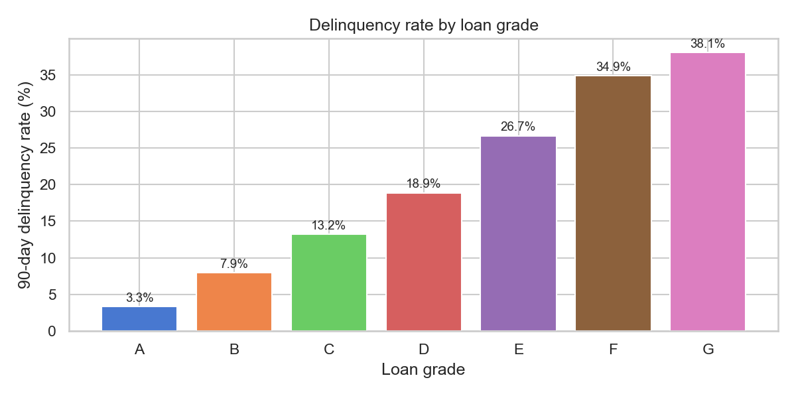
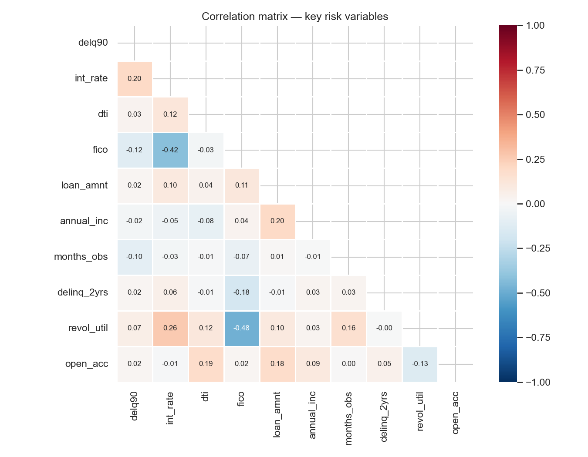
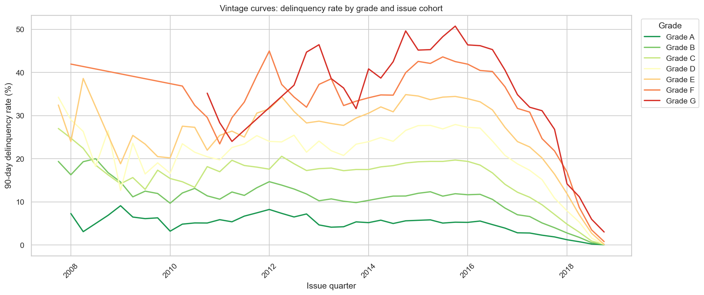
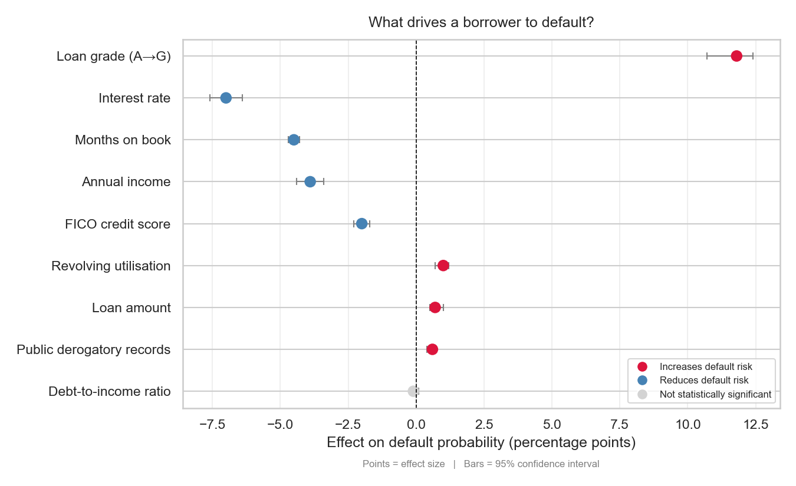
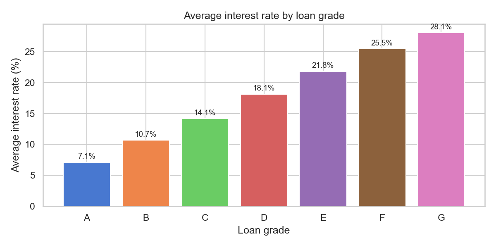
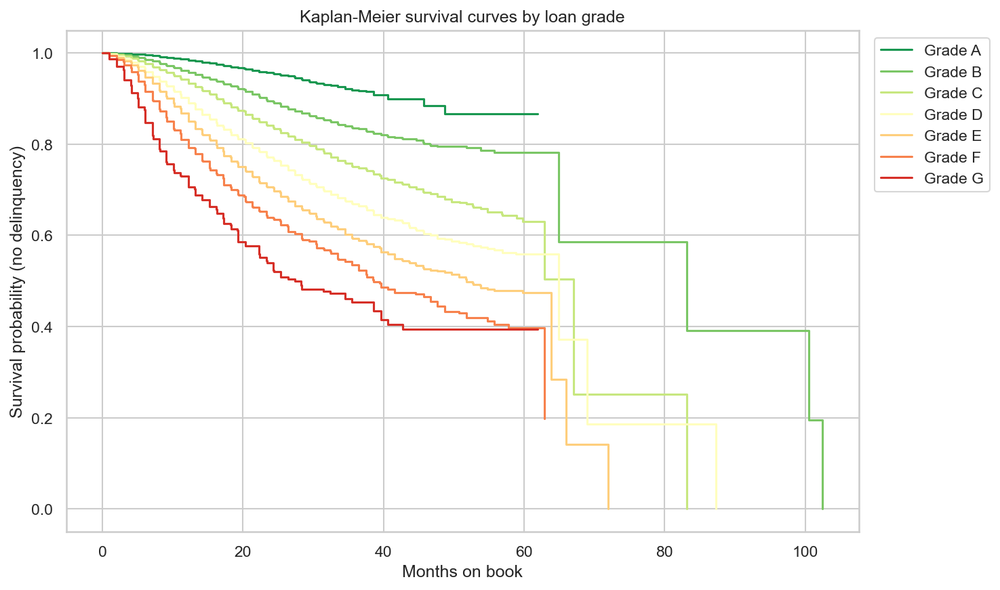
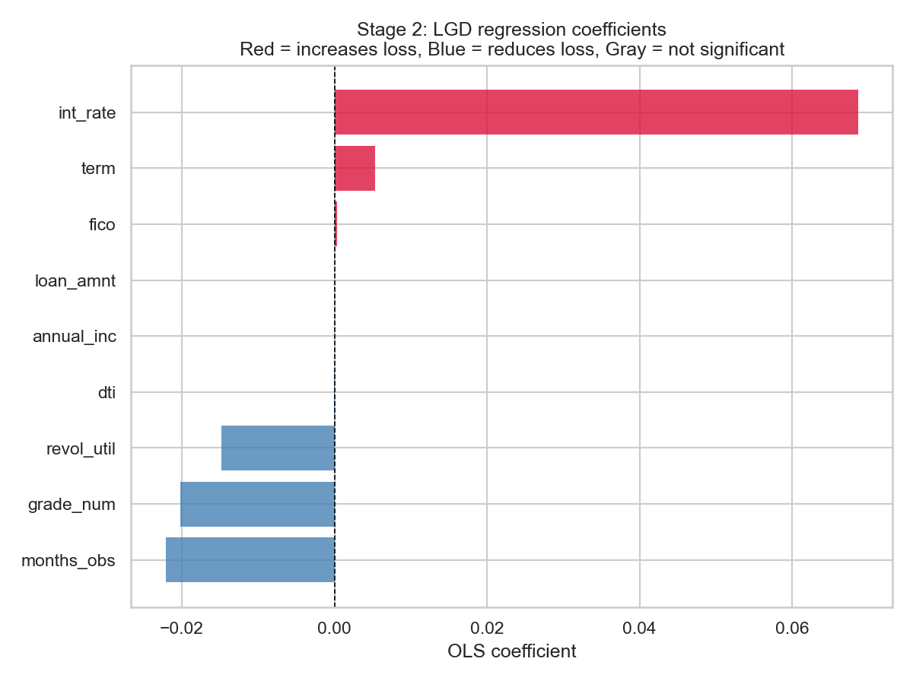
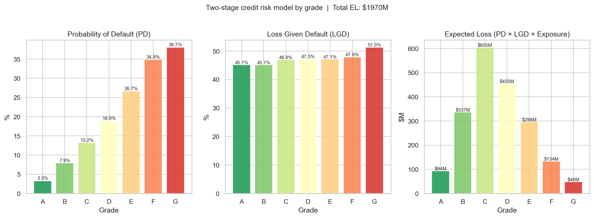
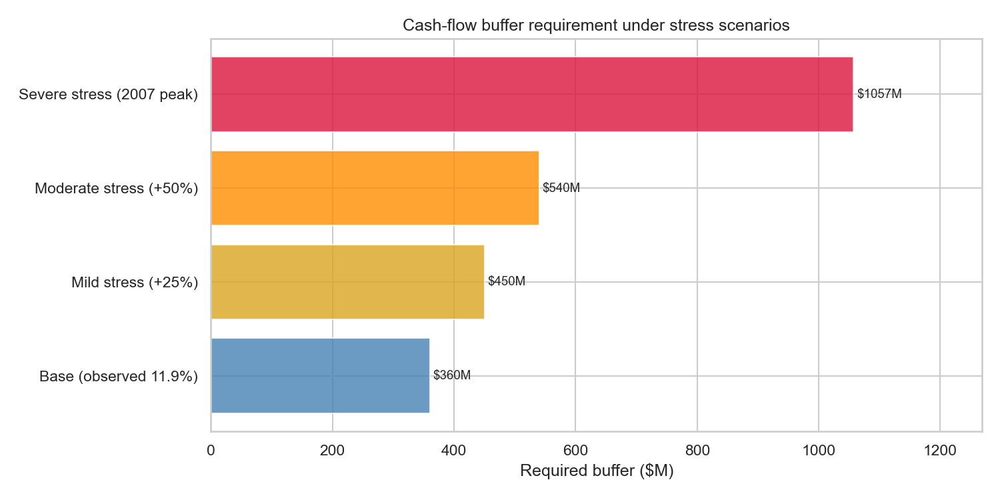
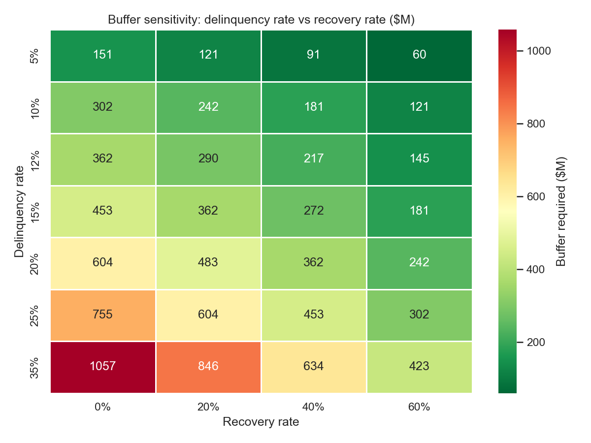

# Lending Club Credit Risk Analysis

**Estimating the cash-flow buffer a lender needs to absorb loan delinquencies.**

This project analyses 2.26 million loans issued between 2007 and 2018 to answer one practical question: *when borrowers stop paying, how much money should a lender hold in reserve to stay solvent?*

It is built in three languages — **Python** (complete), **R** (in progress), and **STATA** (in progress) — each producing the same analysis independently.

---

## 🔴 Try the live risk scorer

The models below are wrapped in an interactive dashboard you can use right now — adjust a hypothetical borrower's profile and watch the risk outputs update live:

**▶ [Open the interactive dashboard](https://thehoodedportal.github.io/Lending-Club-Credit-Risk/)**

It runs entirely in the browser on the project's own fitted coefficients. More detail in [section 7](#7-from-analysis-to-tool-the-interactive-dashboard).

---

## The question

When a borrower misses payments for 90 days, the lender loses the cash flow they were counting on. A bank needs to know, in advance, how large a financial cushion to set aside for this. Set it too low and a downturn threatens solvency; set it too high and capital sits idle.

This project builds a statistically grounded answer in three steps:

1. **How likely is a borrower to default?** (Probability of Default)
2. **If they default, how much is actually lost?** (Loss Given Default)
3. **Combining the two, how big should the buffer be — including under a crisis?**

---

## Headline results

| Question | Answer |
|---|---|
| What share of loans go 90 days delinquent? | **11.9%** |
| When a loan defaults, what fraction is lost? | **46.7%** on average |
| Total expected loss across the portfolio | **$1.97 billion** |
| Buffer needed under normal conditions | **$360M** (36% of one month's cash flow) |
| Buffer needed in a 2008-style crisis | **$1.06B** (105% of one month's cash flow) |

The single most important finding: **a severe downturn would require holding more than an entire month of portfolio cash flow in reserve** — nearly three times the normal-conditions buffer.

---

## How the analysis flows

The project moves from understanding the data, to modelling risk, to sizing the buffer, to wrapping it all in a usable tool. Each stage builds on the last.

### 1. Understanding the loans

The first step is exploring who borrows and how loans are graded. Lending Club assigns each loan a grade from A (safest) to G (riskiest), and that grade turns out to be the strongest single signal of risk.

**Delinquency rises steeply with grade** — from 3.3% for Grade A loans to 38.1% for Grade G.



The risk variables also relate to each other in sensible ways. For example, borrowers with higher credit scores get lower interest rates, and higher credit utilisation goes hand in hand with lower scores.



### 2. Tracking loans over time (vintage analysis)

Grouping loans by the quarter they were issued reveals how different "vintages" performed. The 2007–2008 financial crisis is clearly visible, and recent loans appear artificially safe simply because they haven't had time to go bad yet (a known effect called *maturation bias*).



### 3. Stage 1 — How likely is default?

A logistic regression model predicts whether each loan will become 90 days delinquent. It separates risk well (AUC = 0.72), which is solid for consumer credit.

More useful than the score is *what the model learned*. Each factor's effect is shown below in percentage points of default risk, with bars showing the 95% confidence interval. Loan grade dominates; longer-tenured loans and higher-income borrowers are the safest.



#### What the model can and can't predict

Loan grade dominates because it is Lending Club's own risk score — already built from credit history, income, and other underwriting data before a loan is issued. It absorbs most of the predictive power of the individual variables.

The reason is that interest rate and grade carry almost the same information — Lending Club *sets* the rate from the grade, so the two rise in near-perfect lockstep:

| Delinquency rises with grade | Interest rate rises with grade |
|---|---|
|  |  |

The two charts have the same staircase shape because they are, statistically, carrying the same signal. When two predictors move together this tightly, a model can't cleanly separate their effects — which is why interest rate shows a counterintuitive sign, dissected in the loss model below.

The honest takeaway is that **consumer default is only partly predictable**. The strongest triggers — job loss, illness, divorce — are life events that no loan dataset contains, which is why an AUC around 0.72 is close to the practical ceiling for consumer credit. This is not a flaw in the analysis; it is the central reason a buffer is needed at all. If defaults were perfectly predictable, a lender could price them in precisely and hold no reserve. Because they are not, a cushion sized for uncertainty is essential — which is exactly what the rest of this project quantifies.

We also model *how quickly* loans fail using survival analysis. Grade A loans stay healthy for years; nearly half of Grade G loans have stopped paying within five years.



### 4. Stage 2 — How much is lost when default happens?

Knowing a loan will default isn't enough — we need to know how much money is actually lost. A second regression model estimates this "loss given default" for each loan.

The key insight: **loss severity is roughly constant across grades (45–51%)**. In other words, a loan's grade tells you *whether* it will default, but not *how much* you'll lose if it does.



#### Diagnosing the coefficients

Two coefficients in this project come out with a counterintuitive sign: interest rate in the default model, and loan grade in the loss model above (it reads negative, implying worse grades lose *less* — the opposite of the raw data, where loss rises from ~45% at grade A to ~51% at grade G). Rather than wave these away as "multicollinearity," it's worth pinning down exactly what causes each.

The grade ↔ interest rate overlap shown above is the starting point. Adding the suspect variables to a grade-only loss regression one at a time shows precisely when grade's sign flips:

| Model includes | Grade coefficient | Interest rate coefficient | R² |
|---|---|---|---|
| grade only | **+0.007** | — | 0.001 |
| + interest rate | **−0.059** | +1.877 | 0.015 |
| + FICO | −0.053 | +1.873 | 0.023 |
| + term | −0.058 | +1.861 | 0.026 |
| + months on book | −0.016 | −0.015 | **0.722** |

Two things happen. First, the moment **interest rate** enters, grade flips from positive to sharply negative while interest rate jumps to +1.88 — the two are so collinear that the model arbitrarily hands the "worse loans lose more" signal to interest rate and leaves grade holding a negative residual. Second, when **months on book** enters, R² leaps from 0.03 to 0.72 — loan timing explains almost all loss severity — and interest rate's own effect collapses to near zero, becoming insignificant.

So the two odd coefficients have genuinely different causes:

- **Default model:** interest rate is simply redundant with grade. Dropping it cleans up the coefficients with no loss of predictive accuracy.
- **Loss model:** loss severity is really driven by *when* a loan fails (months on book) — a loan that defaults late has already repaid most of its principal. Grade's effect runs *through* that timing rather than alongside it, so its leftover coefficient is not meaningful on its own.

Two practical consequences follow. For any grade-level figure in this project (Expected Loss, buffer sizing, the dashboard), the **observed average loss by grade** is used rather than the regression coefficient, because the averages reflect the real relationship. And in the interactive dashboard, the interest rate control is deliberately **locked** to the grade by default — with an option to unlock it and a note explaining this exact caveat.

### 5. Putting it together — Expected Loss

Combining the two stages gives **Expected Loss = Probability of Default × Loss Given Default × Loan Exposure** — the standard framework regulated banks use under Basel III.

| Grade | Default probability | Loss if default | Expected loss |
|---|---|---|---|
| A | 3.3% | 45.1% | $94M |
| B | 7.9% | 45.1% | $337M |
| C | 13.2% | 46.9% | **$605M** |
| D | 18.9% | 47.3% | $455M |
| E | 26.7% | 47.1% | $298M |
| F | 34.9% | 47.9% | $134M |
| G | 38.1% | 51.3% | $48M |
| **Total** | | | **$1,970M** |

A subtle but important result: **Grade C loans drive the largest absolute loss** ($605M) — not because they are the riskiest, but because there are so many of them. Concentration matters as much as risk rate.



### 6. Sizing the buffer

Finally, the buffer itself. Under normal conditions the portfolio needs roughly **$360M** — about 36% of a month's scheduled cash flow. But the buffer must survive bad years, not just average ones, so it is stress-tested against progressively worse delinquency rates.

| Scenario | Delinquency rate | Buffer required | Share of monthly cash flow |
|---|---|---|---|
| Normal (observed) | 11.9% | $360M | 36% |
| Mild stress | 14.9% | $450M | 45% |
| Moderate stress | 17.9% | $540M | 54% |
| Severe (2007 crisis level) | 35.0% | $1,057M | 105% |



Because recovery rates are uncertain, a sensitivity table shows the buffer across every combination of delinquency and recovery assumptions — giving decision-makers a full picture rather than a single number.



---

### 7. From analysis to tool: the interactive dashboard

The final step turns the static models into something a lender could actually use. [`index.html`](index.html) is a self-contained dashboard ([live here](https://thehoodedportal.github.io/Lending-Club-Credit-Risk/)) that loads the project's fitted coefficients directly into the browser — no server, no install.

Set a borrower's profile and you immediately see their probability of default, expected loss, and where they rank against the whole portfolio. A live survival curve shows *when* the risk materialises, and a Monte Carlo panel draws 1,000 random loans matching the real grade mix to estimate the reserve such a portfolio would need. It pulls every stage of the project — PD, LGD, survival, and buffer — into one screen.

---

## What's in this repository

```
├── index.html            ← interactive risk dashboard (live demo)
├── data/
│   ├── raw/              ← original CSV (not tracked — too large)
│   └── processed/        ← cleaned data
├── python/               ← complete analysis
│   ├── 00_ingest.py      ← load and clean the data
│   ├── 01_eda.ipynb      ← explore the loans
│   ├── 02_cohort.ipynb   ← vintage analysis over time
│   ├── 03_models.ipynb   ← Stage 1 (default) + Stage 2 (loss)
│   ├── 04_buffer.ipynb   ← buffer sizing and stress tests
│   └── requirements.txt
├── r/                    ← R implementation (in progress)
├── stata/                ← STATA implementation (in progress)
├── output/figures/       ← all charts
└── README.md
```

---

## Method summary

| Phase | Method | Library |
|---|---|---|
| Data cleaning | Column selection, date parsing, feature engineering | `pandas`, `numpy` |
| EDA | Distributions, correlation matrix, cohort analysis | `matplotlib`, `seaborn` |
| Vintage analysis | Cohort curves by grade and year | `pandas`, `matplotlib` |
| Stage 1 — PD | Logistic regression | `scikit-learn`, `statsmodels` |
| Time-to-stoppage | Cox proportional hazards, Kaplan-Meier | `lifelines` |
| Stage 2 — LGD | OLS regression | `statsmodels` |
| Buffer sizing | Scenario analysis, sensitivity table | `numpy` |

**In plain terms:** `pandas` and `numpy` did the heavy lifting of loading 2.26M loans and reshaping the raw data into clean, model-ready variables. `matplotlib` and `seaborn` produced every chart in this README. The Stage 1 default model was built with `scikit-learn` (for the prediction and accuracy scoring) and `statsmodels` (for the regression coefficients and significance tests). `lifelines` handled the survival analysis — measuring not just *whether* a loan defaults but *how quickly*. The Stage 2 loss model used `statsmodels` for a standard regression. The final buffer figures were straightforward arithmetic on the model outputs, handled in `numpy`.

---

## Running it yourself

```bash
cd python
pip install -r requirements.txt

# From the project root, build the cleaned dataset first
python python/00_ingest.py

# Then open the analysis notebooks
jupyter notebook
```

Requires Python 3.10 or newer.

---

## Important caveats

- **This is consumer credit data.** Lending Club loans are unsecured personal loans. The methodology transfers to commercial lending and leases, but the specific numbers would differ.
- **Recent loans look deceptively safe.** Loans from 2017–2018 hadn't matured when the data was collected, so their delinquency rates understate true risk.
- **Models simplify reality.** Default is partly driven by unpredictable life events, so even a good model leaves meaningful uncertainty — which is exactly why a buffer is needed.

---

## Data source

[Lending Club Loan Data — Kaggle](https://www.kaggle.com/datasets/wordsforthewise/lending-club) · `accepted_2007_to_2018Q4.csv` (2.26M loans, 151 columns)
