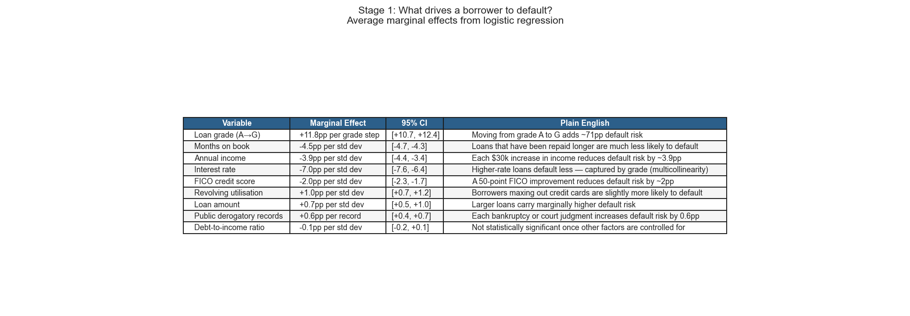
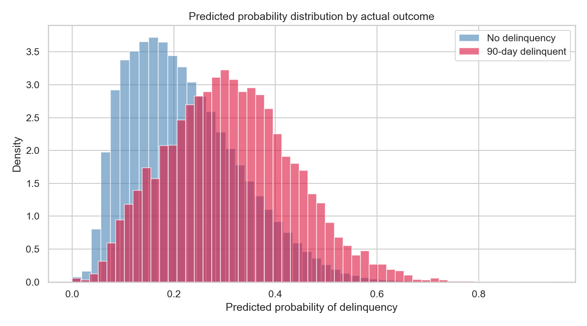

# Lending Club Credit Risk Analysis

A quantitative credit risk project analysing 10 years of Lending Club loan data (2007–2018) to identify predictors of 90-day payment stoppages and estimate the cash-flow buffer required to absorb interruptions.

Built in three languages — **Python** (complete), **R** (in progress), and **STATA** (in progress) — to demonstrate cross-platform analytical capability.

---

## Key findings

| Metric | Value |
|---|---|
| Portfolio size | 2,258,957 loans |
| Overall 90-day delinquency rate | 11.92% |
| Worst cohort | 2007 Q4 (Grade G: 48.6%) |
| Stage 1 — Logistic regression AUC | 0.716 |
| Stage 2 — LGD OLS R-squared | 0.724 |
| Cox model concordance | 0.677 |
| Mean Loss Given Default | 46.7% |
| Total Expected Loss (PD × LGD × Exposure) | $1,970M |
| Base buffer requirement | $360M (35.8% of monthly CF) |
| Severe stress buffer (2007 peak) | $1,057M (105% of monthly CF) |

---

## Project goal

Lenders need a statistically defensible method for sizing the liquidity buffer required when borrowers enter 90-day delinquency. This project implements the industry-standard two-stage credit risk framework:

**Stage 1 — Probability of Default (PD):** Logistic regression predicting whether a loan will enter 90-day delinquency.

**Stage 2 — Loss Given Default (LGD):** OLS regression estimating what fraction of the loan amount is lost once default occurs.

**Expected Loss = PD × LGD × Exposure**

This is the foundation of Basel III credit risk frameworks used by all regulated banks.

---

## Data

**Source:** [Lending Club Loan Data — Kaggle](https://www.kaggle.com/datasets/wordsforthewise/lending-club)

- `accepted_2007_to_2018Q4.csv` (~2.26M rows, 151 columns)
- Raw data is excluded from this repo (see `.gitignore`)

---

## Results

### Delinquency by grade
Clear risk ladder from 3.3% (Grade A) to 38.1% (Grade G).


### Vintage curves
Delinquency rates by issue cohort and grade. Notable: 2007–2008 financial crisis spike, gradual F/G deterioration through 2015–2016, maturation bias in 2017–2018 cohorts.


### Stage 1 — Probability of Default

Logistic regression (AUC = 0.716) identifying key delinquency drivers.



Grade is the dominant positive predictor. Months on book and annual income are the strongest protective factors.



### Survival analysis
Kaplan-Meier curves show Grade A loans maintain 88% survival at 100 months vs Grade G dropping to 43% by month 60. Cox PH model concordance = 0.677.


### Stage 2 — Loss Given Default (OLS regression)

OLS regression on defaulted loans (R² = 0.724). Key finding: LGD is remarkably flat across grades (~45–51%), meaning **grade predicts whether you lose money, not how much**.


### Two-stage Expected Loss by grade

| Grade | PD | LGD | Expected Loss |
|---|---|---|---|
| A | 3.3% | 45.1% | $94M |
| B | 7.9% | 45.1% | $337M |
| C | 13.2% | 46.9% | $605M |
| D | 18.9% | 47.3% | $455M |
| E | 26.7% | 47.1% | $298M |
| F | 34.9% | 47.9% | $134M |
| G | 38.1% | 51.3% | $48M |
| **Total** | | | **$1,970M** |

Grade C drives the largest absolute loss despite not being the riskiest grade — purely due to portfolio concentration.


### Buffer stress scenarios

| Scenario | Delinquency rate | Buffer required | % of monthly CF |
|---|---|---|---|
| Base (observed) | 11.9% | $360M | 35.8% |
| Mild stress | 14.9% | $450M | 44.7% |
| Moderate stress | 17.9% | $540M | 53.6% |
| Severe (2007 peak) | 35.0% | $1,057M | 105.0% |


### Sensitivity analysis
Buffer requirement across combinations of delinquency rate (5%–35%) and recovery rate (0%–60%).


---

## Methods

| Phase | Method | Library |
|---|---|---|
| Data cleaning | Column selection, date parsing, feature engineering | `pandas`, `numpy` |
| EDA | Distributions, correlation matrix, cohort analysis | `matplotlib`, `seaborn` |
| Vintage analysis | Cohort curves by grade and year | `pandas`, `matplotlib` |
| Stage 1 — PD | Logistic regression | `scikit-learn`, `statsmodels` |
| Time-to-stoppage | Cox proportional hazards, Kaplan-Meier | `lifelines` |
| Stage 2 — LGD | OLS regression | `statsmodels` |
| Buffer sizing | Scenario analysis, sensitivity table | `numpy` |

---

## Repository structure

```
├── data/
│   ├── raw/              ← original CSV (gitignored)
│   └── processed/        ← cleaned .parquet output
├── python/
│   ├── 00_ingest.py      ← load, clean, feature engineering
│   ├── 01_eda.ipynb      ← exploratory analysis
│   ├── 02_cohort.ipynb   ← vintage & cohort curves
│   ├── 03_models.ipynb   ← Stage 1 PD, Stage 2 LGD, Cox survival
│   ├── 04_buffer.ipynb   ← buffer estimation & stress testing
│   └── requirements.txt
├── r/                    ← in progress
├── stata/                ← in progress
├── output/
│   └── figures/          ← all charts
└── README.md
```

---

## Setup

```bash
cd python
pip install -r requirements.txt

# Run ingestion first (from project root)
python python/00_ingest.py

# Open Jupyter for analysis notebooks
jupyter notebook
```

**Python 3.10+** recommended.

---

## Limitations

- Lending Club data represents unsecured consumer credit. Findings are directionally informative for commercial lending and lease portfolios but should be interpreted with that distinction in mind.
- 2017–2018 cohorts show artificially low delinquency rates due to maturation bias.
- Buffer estimates assume 90-day stoppages result in full loss of 3 months of scheduled cash flow. Recovery rates are modelled separately in the sensitivity analysis.
- The multicollinearity between grade and interest rate (r = −0.42) means individual coefficients should be interpreted with caution.
