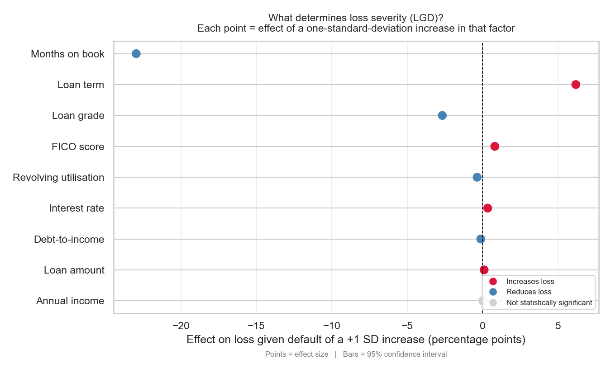
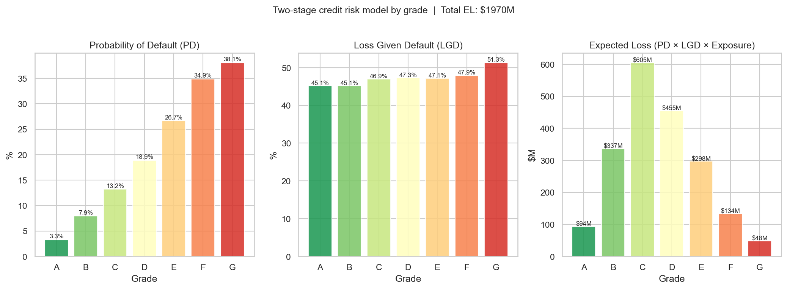
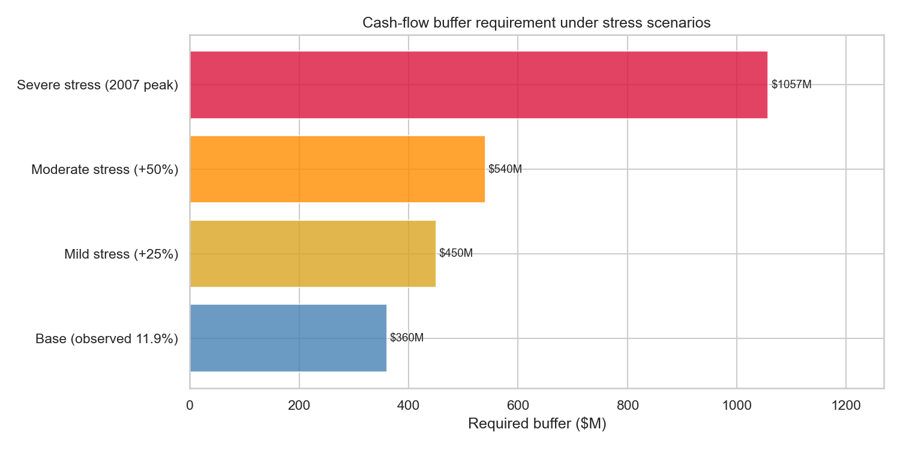
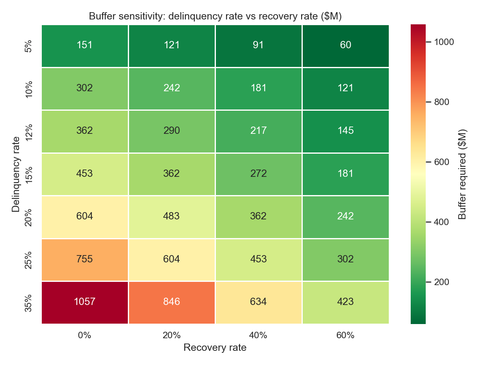

# Lending Club Credit Risk Analysis

**Estimating the cash-flow buffer a lender needs to absorb loan delinquencies.**

This project analyses 2.26 million loans issued between 2007 and 2018 to answer one practical question: *when borrowers stop paying, how much money should a lender hold in reserve to stay solvent?*

It is built in **Python** (complete), with **R** and **STATA** implementations planned to reproduce the same analysis independently.

---

## 🔴 Try the live risk scorer

The models below are wrapped in an interactive dashboard you can use right now — adjust a hypothetical borrower's profile and watch the risk outputs update live:

**▶ [Open the interactive dashboard](https://thehoodedportal.github.io/Lending-Club-Credit-Risk/)**

It runs entirely in the browser on the project's own fitted coefficients. More detail in [section 7](#7-from-analysis-to-tool-the-interactive-dashboard).

---

## The question

When a borrower stops paying, the lender loses cash flow it was counting on. A lender needs to know, in advance, how large a cushion to set aside for this. Set it too low and a downturn threatens solvency; set it too high and capital sits idle earning nothing.

The project sizes that cushion with the **Expected Loss** framework that regulated banks use under Basel III — `Expected Loss = Probability of Default × Loss Given Default × Exposure` — and then stress-tests it. That breaks the work into three questions:

1. **How likely is a borrower to default?** (Probability of Default)
2. **If they default, how much is actually lost?** (Loss Given Default)
3. **Combining the two, how big should the buffer be — including under a crisis?**

---

## Headline results

| Question | Answer |
|---|---|
| What share of loans go 90 days delinquent? | **12.9%** |
| When a loan defaults, what fraction is lost? | **46.7%** on average |
| Total expected loss across the portfolio | **$2.13 billion** |
| Buffer needed under normal conditions | **$389M** (39% of one month's cash flow) |
| Buffer needed in a 2008-style crisis | **$1.06B** (105% of one month's cash flow) |

The single most important finding: **a severe downturn would require holding more than an entire month of portfolio cash flow in reserve** — nearly three times the normal-conditions buffer.

---

## The analysis, step by step

The project moves from understanding the data, to modelling the two pieces of Expected Loss, to sizing the buffer, to wrapping it all in a usable tool. Each stage builds on the last.

### 1. The data, and what "delinquent" means

Every loan carries a Lending Club **grade from A (safest) to G (riskiest)** — the lender's own composite risk score, distilled from credit history and income before the loan is issued. It turns out to be the strongest single signal of risk in the whole dataset.

This analysis labels a loan **delinquent** if its status is `Late (31–120 days)`, `Default`, or `Charged Off`. Lending Club has no exact "90 days past due" flag, so the `Late (31–120 days)` bucket is used as the closest available proxy for a serious, cash-flow-interrupting delinquency. On that definition, **12.9% of loans go bad**, and the rate climbs steeply with grade — **from 3.6% for Grade A to 40.0% for Grade G.**


One caveat shapes everything downstream. Grouping loans by the quarter they were issued ("vintages") shows the 2007–2008 crisis clearly — and shows that **recent loans look deceptively safe simply because they hadn't had time to go bad** by the time the data was collected (a well-known effect called *maturation bias*).


### 2. Stage 1 — How likely is default?

**Setup.** A logistic regression predicts whether a loan will become delinquent, using **only information available when the loan is issued** (grade, interest rate, FICO, income, loan amount, DTI, term, and a few credit-history fields). It is trained on loans issued **2007–2017 and tested on the held-out 2018 vintage**, so the score is judged on loans it has never seen. On that test it reaches **AUC = 0.68** — solid for an application-time model.

More useful than the score is *what the model learned*. The chart below shows how much a one-standard-deviation increase in each factor moves a borrower's default probability, in percentage points, with 95% confidence intervals — putting every factor on a common footing. **Loan grade dominates; higher income and a better credit score are the strongest protective factors.** (Interest rate barely registers on its own because it is set directly from the grade, so the two move in near-lockstep and the model can't separate them.)


**The ceiling is the point.** At AUC ≈ 0.68, **consumer default is only partly predictable — and that is expected.** The strongest triggers (job loss, illness, divorce) are life events no loan dataset contains. This isn't a weakness in the model; it's the entire reason a buffer exists. If default were perfectly predictable a lender could price it in exactly and hold no reserve. Because it isn't, a cushion sized for the uncertainty is essential — which is what the rest of this project quantifies.

### 3. Stage 2 — How much is lost when default happens?

**Setup.** Knowing a loan *will* default isn't enough — we need to know how much is lost. Among loans that actually defaulted, loss given default is measured as the share of principal not recovered through payments: `LGD = (loan amount − total payments received) / loan amount`, bounded to [0, 1]. A second regression (OLS) then relates that loss to the loan's characteristics.

The headline finding: **loss severity is roughly constant across grades (45–51%).** A loan's grade tells you *whether* it will default, but barely anything about *how much* you lose if it does.



#### Why this model isn't used to predict — and what is used instead

The model fits well (R² = 0.74) — but almost all of that comes from one variable: **months on book**, how long the loan had already run before it failed (default early and most of the principal is still owed; default late and it's nearly repaid). Drop it and use only what's known when a loan is *approved*, and the same regression explains just **4%**.

That gap is a matter of *context*, not a flawed model. At **application time** — scoring a brand-new loan, which is what sizing the buffer comes down to — months on book is unknown; it lies in the future, so the one variable that really predicts loss can't be used. But for an **existing book**, where each loan's age is already on record, this same model estimates loss severity loan-by-loan with genuine accuracy — it would be the right tool for valuing or provisioning a portfolio that's already on the shelf.

Because this project sizes the reserve *at origination*, it uses the **observed average loss per grade** for severity instead — known up front, and the unbiased, minimum-variance estimator of exactly the per-grade average that Expected Loss requires (pinned to within about ±0.8 points by the thousands of defaults in each grade).

### 4. Putting it together — Expected Loss

Multiplying the two stages by each grade's outstanding balance gives Expected Loss per grade:

| Grade | Default probability | Loss if default | Expected loss |
|---|---|---|---|
| A | 3.6% | 45.7% | $104M |
| B | 8.7% | 45.4% | $369M |
| C | 14.4% | 47.0% | **$660M** |
| D | 20.4% | 47.4% | $492M |
| E | 28.3% | 46.8% | $313M |
| F | 36.4% | 47.4% | $138M |
| G | 40.0% | 50.6% | $50M |
| **Total** | | | **$2,126M** |

A subtle but important result: **Grade C loans drive the largest absolute loss** ($660M) — not because they are the riskiest, but because there are so many of them. Concentration matters as much as risk rate.



### 5. Sizing the buffer

Expected Loss is the *average* year. A buffer has to survive *bad* years. The buffer here is framed in cash-flow terms: when a loan goes delinquent, the lender stops receiving its instalments, and the working assumption is that **a delinquency costs roughly three months of that loan's instalments** before it is resolved or written off. So:

```
buffer = monthly scheduled cash flow × delinquency rate × 3 months
```

With ~$1.0B in monthly instalments across the portfolio and a 12.9% delinquency rate, the normal-conditions buffer is about **$389M — roughly 39% of a single month's cash flow.** The buffer is then stress-tested against progressively worse delinquency rates:

| Scenario | Delinquency rate | Buffer required | Share of monthly cash flow |
|---|---|---|---|
| Normal (observed) | 12.9% | $389M | 39% |
| Mild stress | 16.1% | $486M | 48% |
| Moderate stress | 19.3% | $583M | 58% |
| Severe (2007 crisis level) | 35.0% | $1,057M | 105% |



The headline figures assume no recovery on delinquent balances. Because real recovery rates are uncertain, a sensitivity table shows the buffer across every combination of delinquency rate and recovery rate (0–60%) — giving a decision-maker a full picture rather than a single point estimate.



### 6. Supporting analysis — how *quickly* loans fail

This piece sits outside the buffer arithmetic, but it answers a natural follow-up: not just *whether* a loan defaults, but *when*. A Cox proportional-hazards model and Kaplan-Meier curves model time-to-delinquency: **Grade A loans stay healthy for years, while nearly half of Grade G loans have stopped paying within five years.** This is what powers the live survival curve in the dashboard (it does not feed the Expected-Loss or buffer numbers above).


### 7. From analysis to tool: the interactive dashboard

The final step turns the static models into something a lender could actually use. [`index.html`](index.html) is a self-contained dashboard ([live here](https://thehoodedportal.github.io/Lending-Club-Credit-Risk/)) that loads the project's fitted coefficients directly into the browser — no server, no install.

Set a borrower's profile and you immediately see their probability of default, expected loss, and where they rank against the whole portfolio. A live survival curve shows *when* the risk materialises, and a Monte Carlo panel draws 1,000 random loans matching the real grade mix to estimate the reserve such a portfolio would need. It pulls every stage of the project — PD, LGD, survival, and buffer — into one screen.

---

## What's in this repository

```
├── index.html            ← interactive risk dashboard (live demo)
├── data/
│   ├── raw/              ← original CSV (not tracked — too large for GitHub)
│   └── processed/        ← cleaned data (generated by 00_ingest.py, not tracked)
├── python/               ← complete analysis
│   ├── 00_ingest.py      ← load and clean the data
│   ├── 01_eda.ipynb      ← explore the loans
│   ├── 02_cohort.ipynb   ← vintage analysis over time
│   ├── 03_models.ipynb   ← Stage 1 (default) + Stage 2 (loss)
│   ├── 04_buffer.ipynb   ← buffer sizing and stress tests
│   └── requirements.txt
├── r/                    ← R implementation (planned — not yet present)
├── stata/                ← STATA implementation (planned — not yet present)
├── output/figures/       ← charts
└── README.md
```

Note: `data/` is not tracked in this repository. After cloning, create `data/raw/`, download the Lending Club CSV into it, and run the ingest script to build the processed dataset.

---

## Method summary

| Phase | Method | Library |
|---|---|---|
| Data cleaning | Column selection, date parsing, feature engineering | `pandas`, `numpy` |
| EDA | Distributions, correlation matrix, cohort analysis | `matplotlib`, `seaborn` |
| Vintage analysis | Cohort curves by grade and year | `pandas`, `matplotlib` |
| Stage 1 — PD | Logistic regression (application-time features only) | `scikit-learn`, `statsmodels` |
| Time-to-default | Cox proportional hazards, Kaplan-Meier | `lifelines` |
| Stage 2 — LGD | OLS regression | `statsmodels` |
| Buffer sizing | Scenario analysis, sensitivity table | `numpy` |

---

## Running it yourself

```bash
# Install dependencies
pip install -r python/requirements.txt

# Download the Lending Club CSV from Kaggle into data/raw/
# then build the cleaned dataset from the project root:
python python/00_ingest.py

# Open the analysis notebooks
jupyter notebook python/
```

Requires Python 3.10 or newer. The raw CSV (`accepted_2007_to_2018Q4.csv`) must be downloaded manually from [Kaggle](https://www.kaggle.com/datasets/wordsforthewise/lending-club) and placed in `data/raw/` before running the ingest script.

---

## Important caveats

- **This is consumer credit data.** Lending Club loans are unsecured personal loans. The methodology transfers to commercial lending and leases, but the specific numbers would differ.
- **Recent loans look deceptively safe.** Loans from 2017–2018 hadn't matured when the data was collected, so their delinquency rates understate true risk.
- **The buffer rests on simplifying assumptions.** It charges three months of lost instalments per delinquency and (in the headline figures) assumes no recovery; the sensitivity table is included precisely because those assumptions are uncertain.
- **Models simplify reality.** Default is partly driven by unpredictable life events, so even a good model leaves meaningful uncertainty — which is exactly why a buffer is needed.

---

## Data source

[Lending Club Loan Data — Kaggle](https://www.kaggle.com/datasets/wordsforthewise/lending-club) · `accepted_2007_to_2018Q4.csv` (2.26M loans, 151 columns)
