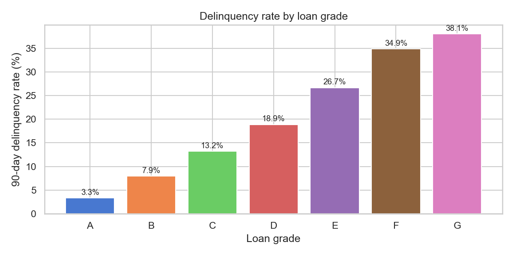
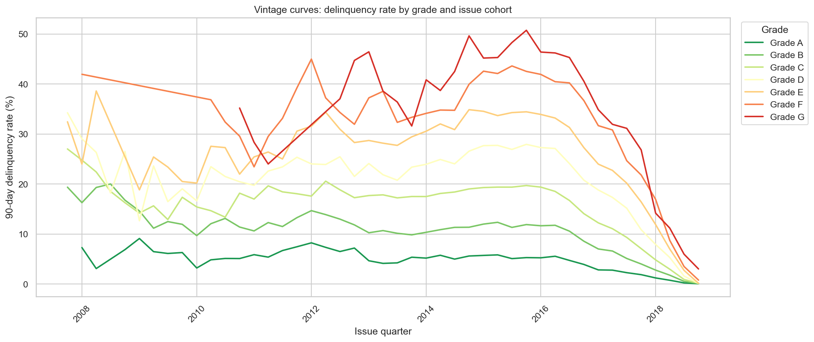
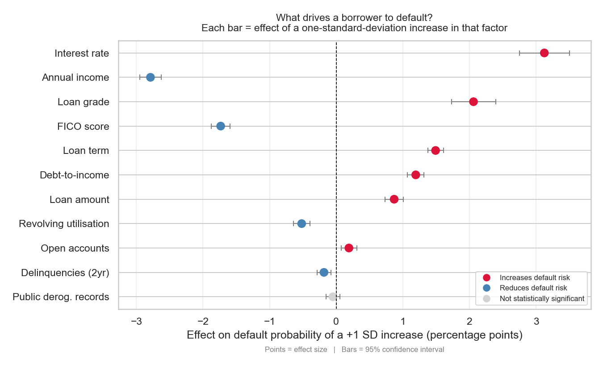
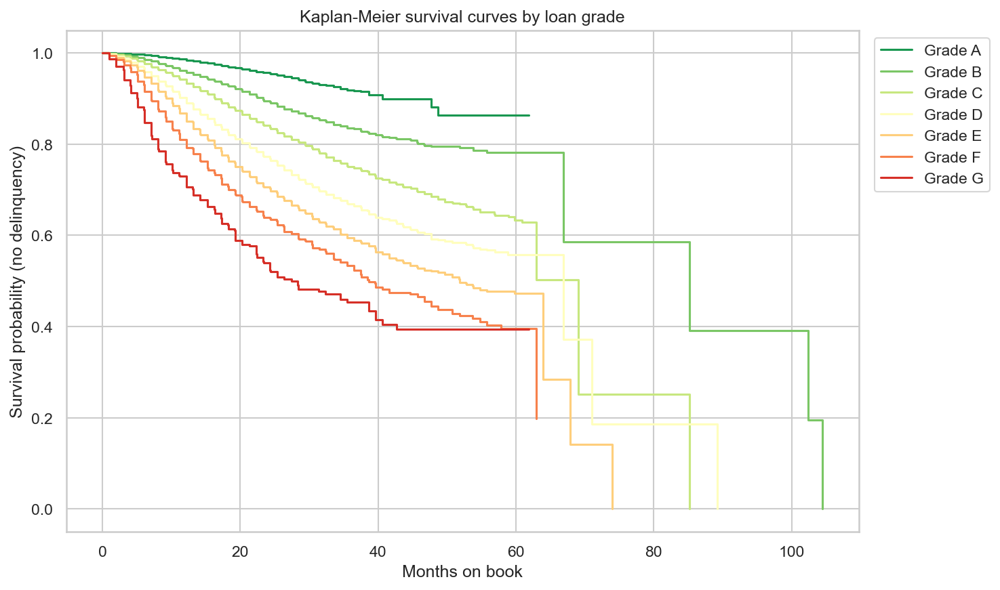
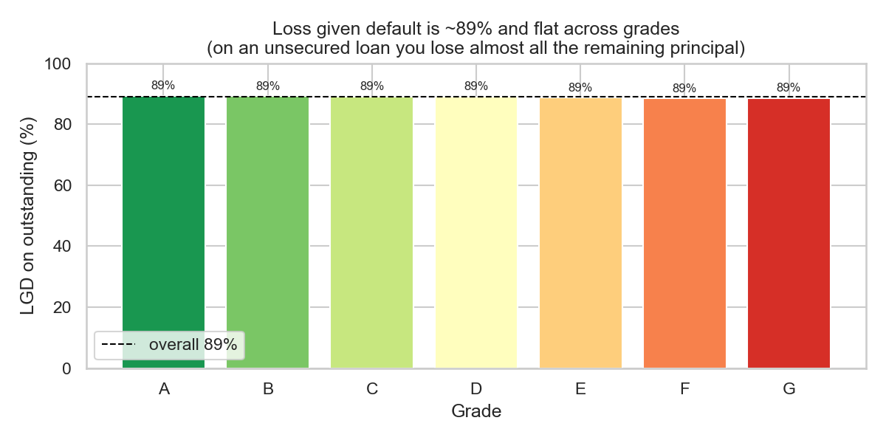
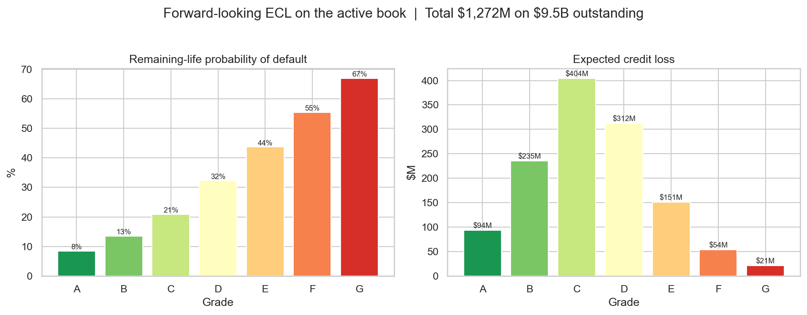
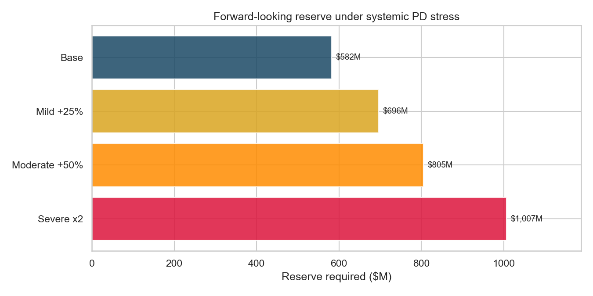
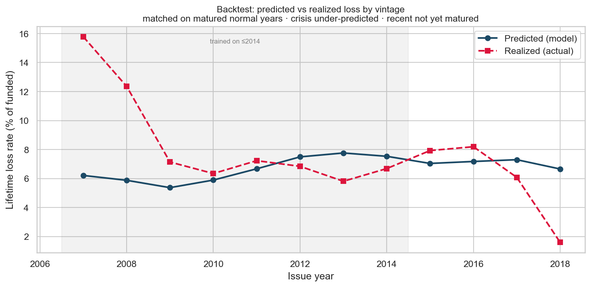

# Lending Club Credit Risk — Forward-Looking Loss Reserve

**How much should a lender set aside today for the losses its current loan book will eventually take?**

This project analyses 2.26 million loans issued between 2007 and 2018, trains credit models on the loans whose outcomes are already known, and uses them to estimate the **expected credit loss on the loans that are still open** — the reserve a lender should hold against its live book. It is built in **Python** (complete), with **R** and **STATA** implementations planned to reproduce the same analysis independently.

---

## 🔴 Try the live risk scorer

The models are wrapped in an interactive dashboard — adjust a borrower's profile and watch the risk outputs update live:

**▶ [Open the interactive dashboard](https://thehoodedportal.github.io/Lending-Club-Credit-Risk/)**

It runs entirely in the browser on the project's own fitted coefficients. More in [section 6](#6-the-interactive-dashboard).

---

## The question

A lender holding a book of loans needs to know, *today*, how much to reserve for the losses that book will take over its remaining life. Reserve too little and a downturn threatens solvency; too much and capital sits idle. The standard framework (IFRS 9 / CECL, and Basel) is **Expected Credit Loss**:

```
Expected Loss  =  Probability of Default  ×  Loss Given Default  ×  Exposure
```

The work splits into three model questions, then applies them to the live book:

1. **How likely is a loan to default over its remaining life?** (PD)
2. **If it defaults, how much is lost?** (LGD)
3. **Applied to every open loan and summed — what reserve does the book need, and how does it move in a downturn?**

The crucial discipline throughout: a model used to score a loan today may only use information **known today**. Outcomes and post-origination data train the models; they never leak into a forward prediction.

---

## Headline results

| Question | Answer |
|---|---|
| Outstanding exposure on the active book | **$9.5B** (911k open loans) |
| Expected credit loss on that book (the reserve) | **$1.31B** (14% of outstanding) |
| Reserve under a severe (2×) downturn in default rates | **~$2.34B** (25%) |
| Historical 90-day delinquency rate (all loans) | 12.9% |
| Default-model discrimination (AUC, out-of-time test) | 0.68 |

The reserve is **model-driven and backtested**: on matured, normal-condition vintages the predicted loss rate matches what actually happened.

---

## The analysis, step by step

### 1. The data, and what "delinquent" means

Every loan carries a Lending Club **grade from A (safest) to G (riskiest)** — the lender's own composite risk score, set before issue. It is the strongest single signal of risk in the data.

A loan is labelled **delinquent** if its status is `Late (31–120 days)`, `Default`, or `Charged Off` (the closest available proxy for a serious, cash-flow-interrupting delinquency). On that definition **12.9%** of loans go bad, climbing steeply with grade — **3.6% for Grade A to 40.0% for Grade G.**



The book splits into **resolved loans** (Fully Paid / Charged Off / Default — outcomes known, used to *train* the models) and **active loans** (Current / In-grace / Late — still open, the book we *reserve against*). Grouping by issue quarter shows the 2007–08 crisis clearly, and shows that recent vintages look deceptively safe because they haven't had time to go bad yet — *maturation bias*, which the forward-looking approach and the backtest both account for.



### 2. Probability of default — and *when*

**Discrimination (application-time).** A logistic regression predicts whether a loan will default using only information available at issue, trained on 2007–2017 and tested on the held-out 2018 vintage (**AUC = 0.68** — solid for consumer credit). More useful than the score is *what it learned*: each bar is the change in default probability for a one-standard-deviation increase in a factor, on a common footing. **Loan grade dominates; higher income and a better credit score are the strongest protective factors.**



The ceiling is the point: at AUC ≈ 0.68 **consumer default is only partly predictable**, because the strongest triggers — job loss, illness, divorce — are life events no loan dataset contains. That irreducible uncertainty is exactly why a reserve exists.

**Timing (the forward-looking engine).** A Cox proportional-hazards survival model captures not just *whether* but *when* loans default. Grade A loans stay healthy for years; nearly half of Grade G loans have stopped paying within five years. This is what makes a forward-looking PD possible: for a loan that has **already survived to its current age**, the survival curve gives its probability of defaulting over its *remaining* life — using only its age today, no look-ahead.



### 3. Loss given default — can we predict it?

When a loan defaults the lender loses the **outstanding principal**, less whatever it recovers (`loss = LGD × exposure-at-default`). The natural question is whether that loss severity can be modelled loan-by-loan, the way default probability is.

**It can't — and that's the finding.** A regression of LGD on *every* loan feature — grade, rate, FICO, income, term, even months-on-book — explains just **0.6%** of its variation, and no single feature reaches 0.2%. On an unsecured loan there's no collateral, so what gets recovered after default is essentially idiosyncratic; it doesn't track the borrower or the loan.

So the honest estimate is simply the **observed average** — and that's a measured fact, not an assumption. For each defaulted loan, take the principal still owed when it stopped paying (borrowed minus repaid), subtract whatever was later clawed back through collections; that's the loss. Across the ~269,000 charged-off loans the lender got back only about **11 cents on the dollar**, so **LGD ≈ 89%** — and flat across grades:



The timing effect you might expect in severity — a seasoned loan loses less — isn't gone; it lives in the **exposure**. How much is still owed falls as a loan amortises, so the reserve holds severity flat at ~89% and lets the outstanding balance carry the variation (and at portfolio scale the loan-to-loan scatter diversifies away).

### 4. The forward-looking reserve

Putting the pieces together on the **active book** — for every open loan, `remaining-life PD × LGD (≈89%) × exposure-at-default`, where exposure is the amortised balance projected to the loan's expected default month, summed:



The reserve comes to **$1.31B on $9.5B of outstanding exposure (14%)**. **Grade C drives the largest absolute share** ($417M) — not because it's the riskiest, but because there is so much of it. Concentration matters as much as rate.

**A bad year is *systemic*, not random.** With ~900k loans, individual-loan default randomness diversifies away almost entirely — a Monte-Carlo over independent defaults gives a 95th percentile essentially equal to the mean. The reserve's real uncertainty is a **downturn lifting everyone's default rate at once**, so the book is stress-tested by scaling PD:



| Scenario | Reserve | % of outstanding |
|---|---|---|
| Base (current conditions) | $1,314M | 13.8% |
| Mild stress (+25% PD) | $1,589M | 16.7% |
| Moderate stress (+50% PD) | $1,852M | 19.5% |
| Severe (2× PD) | $2,338M | 24.6% |

### 5. Does it hold up? A backtest

The honest test: train the models on a **past slice** (loans issued ≤ 2014), then predict each vintage's lifetime loss rate and compare to what was actually realized.



On **matured, normal-condition vintages (2010–2016) the prediction tracks reality** (predicted ~9–13% vs realized ~8–11%), running slightly conservative. Two gaps are expected and informative: the **2007–08 crisis** vintages are under-predicted because the model has no macro variable, and the most **recent** vintages show predicted above realized simply because those loans haven't had time to default yet. Where loans have seasoned and conditions were normal, the forward-looking reserve matches what happened — which is the validation that matters.

### 6. The interactive dashboard

[`index.html`](index.html) ([live here](https://thehoodedportal.github.io/Lending-Club-Credit-Risk/)) loads the fitted coefficients into the browser — no server, no install. Set a borrower's profile and see their probability of default, loss given default, expected loss, and where they rank against the portfolio, plus a live survival curve showing *when* the risk materialises.

---

## What's in this repository

```
├── index.html            ← interactive risk dashboard (live demo)
├── data/
│   ├── raw/              ← original CSV (not tracked — too large for GitHub)
│   └── processed/        ← cleaned data (generated by 00_ingest.py, not tracked)
├── python/               ← complete analysis
│   ├── 00_ingest.py      ← load and clean; add loan age + resolved/active flag
│   ├── 01_eda.ipynb      ← explore the loans
│   ├── 02_cohort.ipynb   ← vintage analysis over time
│   ├── 03_models.ipynb   ← PD (logistic + survival) and LGD models
│   ├── 04_reserve.ipynb  ← forward-looking ECL on the active book + backtest
│   └── requirements.txt
├── r/                    ← R implementation (planned — not yet present)
├── stata/                ← STATA implementation (planned — not yet present)
├── output/figures/       ← charts
└── README.md
```

`data/` is not tracked. After cloning, create `data/raw/`, download the Lending Club CSV into it, and run the ingest script.

---

## Method summary

| Phase | Method | Library |
|---|---|---|
| Data cleaning | Column selection, date parsing, loan age, recovery fields, resolved/active split | `pandas`, `numpy` |
| EDA & vintage analysis | Distributions, correlation, cohort curves | `matplotlib`, `seaborn` |
| PD — discrimination | Logistic regression (application-time features, out-of-time test) | `scikit-learn`, `statsmodels` |
| PD — timing | Cox proportional hazards, Kaplan-Meier → remaining-life PD | `lifelines` |
| LGD | Loss on outstanding principal — flat ~89% (recovery ~11%); regression confirms it's unpredictable (R² < 1%) | `pandas`, `statsmodels` |
| Exposure at default | Scheduled outstanding balance at the projected default month (amortisation) | `numpy` |
| Reserve | Loan-level expected credit loss (PD × LGD × EAD) on the active book + PD stress + vintage backtest | `numpy` |

---

## Running it yourself

```bash
pip install -r python/requirements.txt
# Download the Lending Club CSV from Kaggle into data/raw/, then from the project root:
python python/00_ingest.py
jupyter notebook python/
```

Requires Python 3.10+. The raw CSV (`accepted_2007_to_2018Q4.csv`) must be downloaded from [Kaggle](https://www.kaggle.com/datasets/wordsforthewise/lending-club) into `data/raw/` first.

---

## Important caveats

- **This is consumer credit data.** Lending Club loans are unsecured personal loans; the methodology transfers to other lending but the specific numbers would differ.
- **No macroeconomic variable.** The models learn loan-level risk, not the cycle — so they under-predict crisis vintages (visible in the backtest). A production reserve would overlay a macro scenario.
- **Maturation.** Recent vintages haven't fully matured; the forward-looking PD projects their remaining life, and the backtest shows the gap explicitly.
- **The reserve rests on modelling choices.** LGD is a flat ~89% (≈11% recovery) and exposure-at-default uses the scheduled amortised balance; the stress range, not a single point, is the honest output.
- **Models simplify reality.** Default is partly driven by unpredictable life events — which is the whole reason a reserve is needed.

---

## Data source

[Lending Club Loan Data — Kaggle](https://www.kaggle.com/datasets/wordsforthewise/lending-club) · `accepted_2007_to_2018Q4.csv` (2.26M loans, 151 columns)
